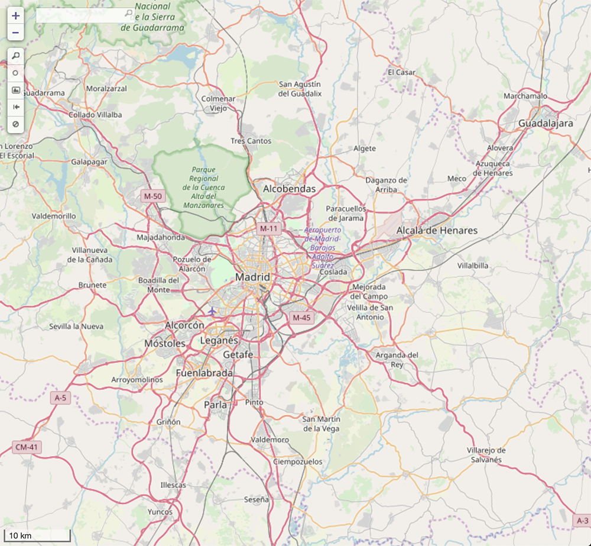

# **Get EX gyms**
This bash script runs [osmcoverer](https://github.com/MzHub/osmcoverer) in such a way that it obtains EX gyms and "EX gyms" that are in an exclusion area.

## **Index**
* [Prerequisites](#prerequisites)
    * [Windows](#windows-prerequisites)
    * [macOS or Linux](#macos-or-linux-prerequisites)
* [Set up the script](#set-up-the-script)
    * [Windows](#windows-set-up)
    * [macOS or Linux](#macos-or-linux-set-up)
* [How to use](#how-to-use)
    * [Flags](#flags)
        * [--noalias](#--noalias)
        * [--fixencoding](#--fixencoding)
        * [--addheader](#--addheader)
* [What does the script do](#what-does-the-script-do)
    * [Output files](#output-files)
        * [gyms_data_blocked.csv](#gyms_data_blocked.csv)
        * [gyms_data_ex.csv](#gyms_data_ex.csv)
* [Example data](#example-data)
* [Run script with the example data](#run-script-with-the-example-data)
    * [Windows](#windows-run-example)
    * [macOS or Linux](#macos-or-linux-set-up)
* [How to get GeoJSON files](#how-to-get-geojson-files)
    * [EX areas query](#ex-areas-query)
    * [Exclusion areas query](#exclusion-areas-query)
* [References](#references)

# **Prerequisites**
You need to have [osmcoverer](https://github.com/MzHub/osmcoverer) on your computer and Windows' users also need to have [Cygwin](https://cygwin.com).

## **Windows prerequisites**
1. Go to [Cygwin](https://cygwin.com) and install it.

2. Open **Cygwin Terminal** (this will create some folders in **C:\\cygwin\\home**).

3. Go to [osmcoverer releases](https://github.com/MzHub/osmcoverer/releases), download the file for Windows and extract it.

4. Copy (or move) the file called **osmcoverer.exe** to **C:\\cygwin\\home\\\<user>** (or any subfolder).

Now you have Cygwin and osmcoverer set up.

## **macOS or Linux prerequisites**
1. Go to [osmcoverer releases](https://github.com/MzHub/osmcoverer/releases), download the file for macOS or Linux and extract it.

2. Open the Terminal app an go to the folder where you have extracted the file (```cd /path_to_the_folder```).

3. Type ```chmod 755 osmcoverer```

4. Type ```mv osmcoverer /usr/local/bin/```

Now you have osmcoverer set up.

# **Set up the script**

## **Windows set up**
1. Clone or download this repo. Then move the files to **C:\\cygwin\\home\\\<user>** (or any subfolder). The file called **<span>getexgyms.sh</span>** has to be in the same folder as **osmcoverer.exe**.

## **macOS or Linux set up**
1. Clone or download this repo. Then move the files to the folder you want to have the output files.

# **How to use**
To run the code type:

```./getexgyms.sh gyms_data.csv exareas_data.geojson exclusionareas_data.geojson (--noalias --fixencoding --addheader)```

Where:
* **gyms_data.csv:** file with gyms's data.
    * **Estructure of the csv file:** Name,Latitude,Longitude. **(Do NOT include a header row)**

* **exareas_data.geojson:** exported file from overpass-turbo.eu with EX areas

* **exclusionareas_data.geojson:** exported file from overpass-turbo.eu with exclusion areas

* **--noalias:** it'll run the commands with ./osmcoverer

* **--fixencoding:** file with blocked gyms will be encoded to MS-ANSI. Might be needed to upload the file to My Maps

* **--addheader:** add a header row. Needed if you want to upload to My Maps

## **Flags**
### **--noalias**
If this flag is not included then the script will run **osmcoverer** simply as ```osmcoverer```. If you've moved the file to the folder /usr/local/bin (in macOS or Linux) or if you've written an alias in the file _.bashrc_ (or equivalent) the script should find osmcoverer.

If this flag is included then the script will run **osmcoverer** as ```./osmcoverer```. This implies that **osmcoverer** has to be in the same folder as **<span>getexgyms.sh</span>**.

If you've followed the instructions for Windows, you need to include this flag.

### **--fixencoding**
This flag might be needed if you want to upload the file with blocked gyms to My Maps. Otherwise it might happend what is shown in this picture:


### **--addheader**
This flag will include a row at the begining of the output files with the text:
> Name,Latitude,Longitude

This is needed if you want to upload the ouput files to My Maps. If you don't do this, the first row of the data will be used as a header.

# **What does the script do**
*Note: read reference 1 if you want to know more about input parameters of osmcoverer*

1. Run oscoverer with this configuration:
    * -markers=gyms_data.csv *(all gyms)*

    * \<input file> is exareas_data.geojson
    
    With this first run, the output file (markers_within_features.csv) contains all gyms inside an EX area. This file is renamed to **gyms_data_ex_with_blocked.csv** and moved to the folder **getexgyms_results**.

2. Run oscoverer with this configuration:
    * -markers=gym_data_ex_with_blocked.csv

    * \<input file> is exclusionareaa_data.geojson

    With this second run, the output (markers_within_features.csv) contains all gyms inside an EX area and also an exclusion area. This file is renamed to **gyms_data_blocked.csv** and moved to the folder **getexgyms_results**.

3. After this, a third file called **gyms_data_ex.csv** is created. It has all gyms from the file called **gyms_data_ex_with_blocked** that are not in the file called **gyms_data_blocked.csv**. So this file only contains all gyms inside an EX area but are outside an exclusion area.

4. The file called **gyms_data_ex_with_blocked** is removed.

## **Output files**
Just as a recap, once you have run the script 2 files are saved in the folder **getexgyms_results**:

### **gyms_data_blocked.csv**
This file contains **all the gyms inside an EX area that are also inside an exclusion area**.

## **gyms_data_ex.csv**
This file only contains **all gyms inside an EX area but are outside an exclusion area**.

# **Example data**
The data in the _example_data_ folder includes all the gyms in Alcobendas and San Sebastián de los Reyes ("AlcoSanse"), and EX and exclusion areas of Madrid.

The area included is this one:


# **Run script with the example data**
## **Windows run example**
1. In **Cygwin Terminal** type ```cd /home/<user>``` (or any subfolder).

2. Type ```./getexgyms.sh example_data/gymsAlcoSanse.csv example_data/madrid_exareas.geojson example_data/madrid_exclusionareas.geojson --noalias```

The flag **--noalias** runs the code assuming that **osmcoverer** is in the same folder as **<span>getexgyms.sh</span>**
## **macOS or Linux run example**

1. Open the Terminal app an go to the folder where you want to have the output files (```cd /path_to_the_folder```).

2. Type ```./getexgyms.sh example_data/gymsAlcoSanse.csv example_data/madrid_exareas.geojson example_data/madrid_exclusionareas.geojson```

# **How to get GeoJSON files**
To get each file you'll have to run a specific query in the website overpass-turbo.eu. In the folder _overpass-turbo_queries_ of this repo there are 2 txt files with the queries for EX and exclusion areas but you can also use the following links:

## **EX areas query**
Query: https://overpass-turbo.eu/s/HE5

Run the query and then download (export) as a GeoJSON file.

*Note: this is a modified version of the query found in reference 2 (by reddit user /u/Tntnnbltn).*

## **Exclusion areas query**
Query: https://overpass-turbo.eu/s/HE8

Run the query and then download (export) as a GeoJSON file.

*Note: this is a modified version of the query found in reference 3 (by reddit user /u/Tntnnbltn).*

*Note 2: if you check reference 4, in that post from reddit user u/NicoisLost it's included a query that happens to be the same as mine. I came across that reddit post after doing this project (while checking for references that might help anyone). In any case I think is worth mentioning him and the work he has done.*

# **References**

[1] [GitHub - MzHub/osmcoverer](https://github.com/MzHub/osmcoverer)

[2] [How to determine which gyms are eligible from EX Raids: Findings from a worldwide analysis of 1000+ EX Raid locations](https://www.reddit.com/r/TheSilphRoad/comments/7ojuoi/how_to_determine_which_gyms_are_eligible_from_ex/)

[3] [The Death of New EX Raid Eligible Gyms: Changes to Niantic’s EX Eligibility Detection System since July 2018.](https://www.reddit.com/r/TheSilphRoad/comments/akcel3/the_death_of_new_ex_raid_eligible_gyms_changes_to/)

[4] [New evidence on tag-blocked park gyms](https://www.reddit.com/r/TheSilphRoad/comments/9iie5g/new_evidence_on_tagblocked_park_gyms/)